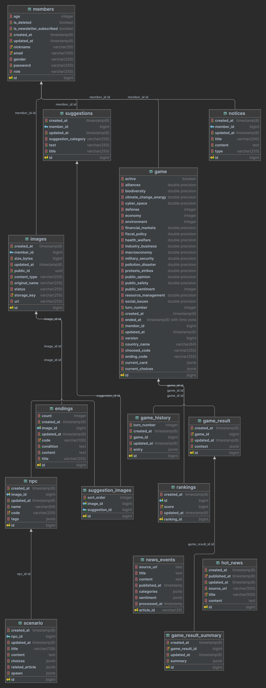
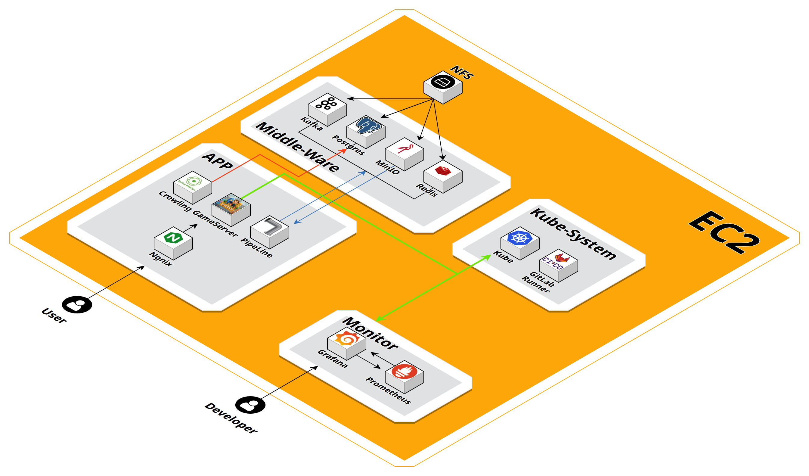
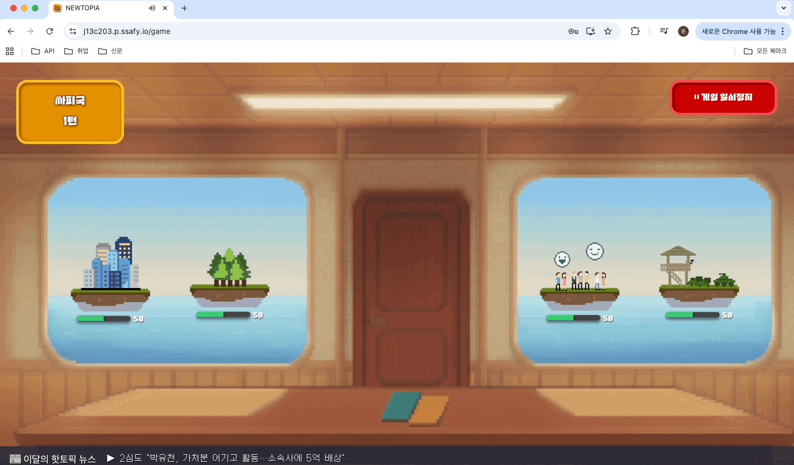
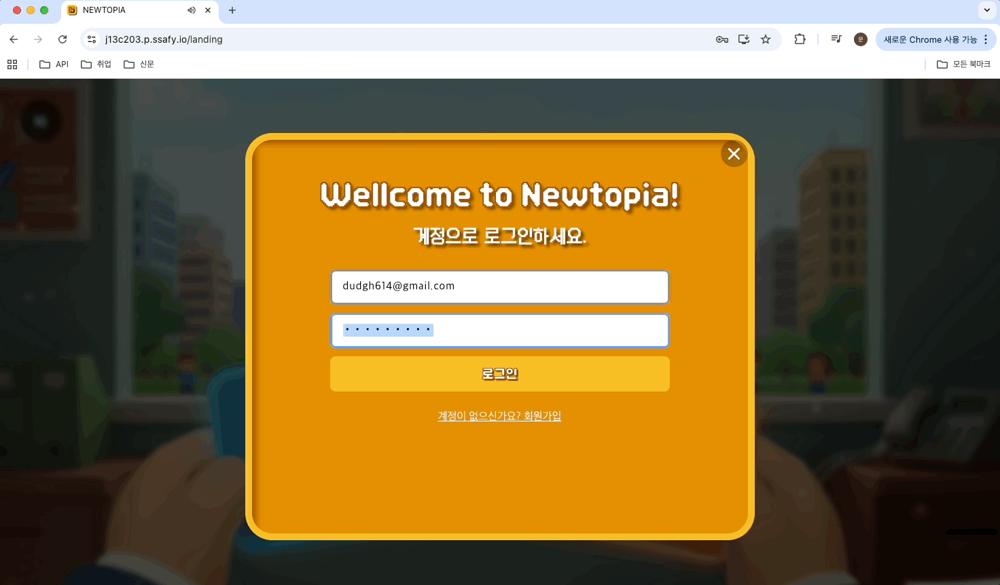
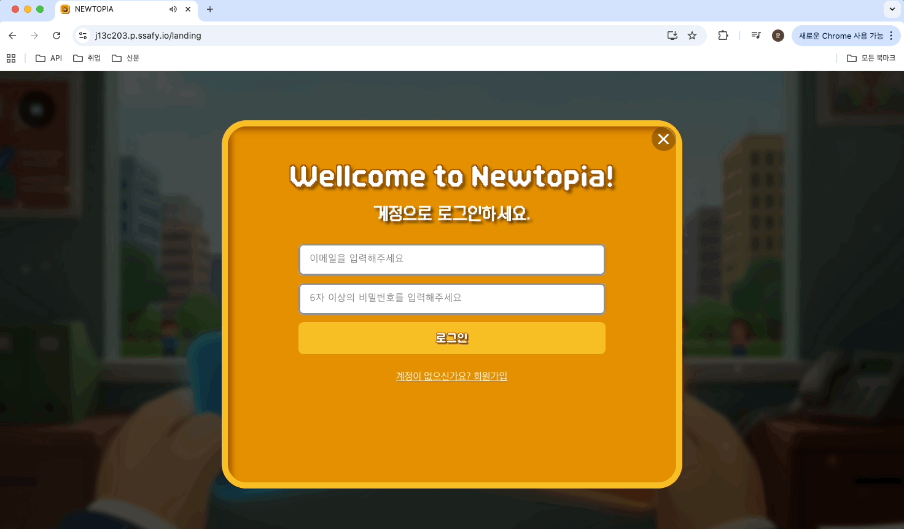
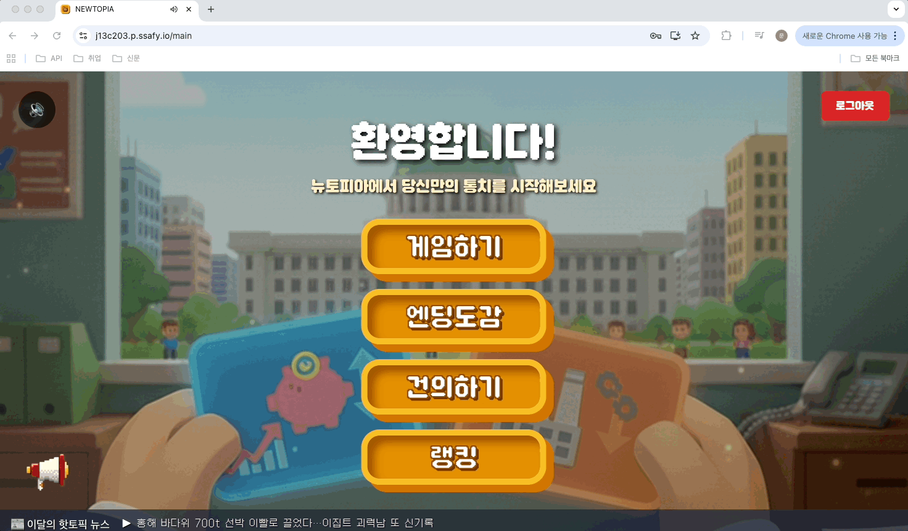
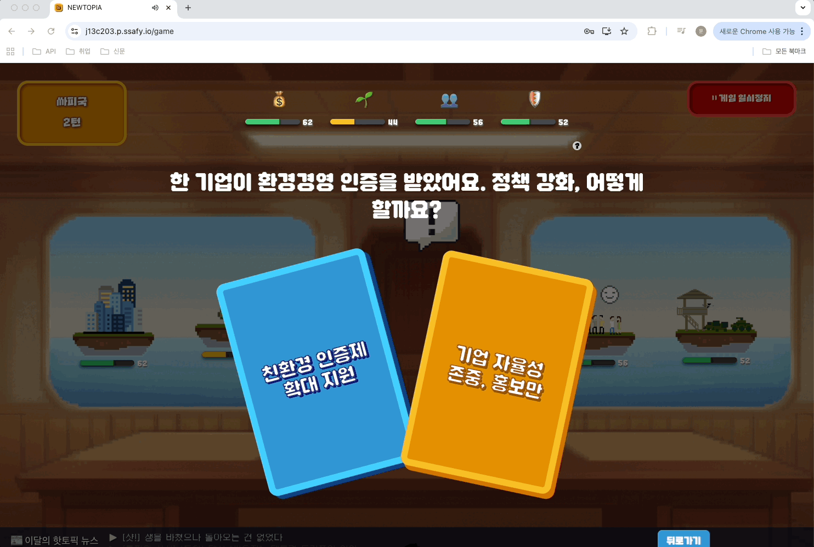
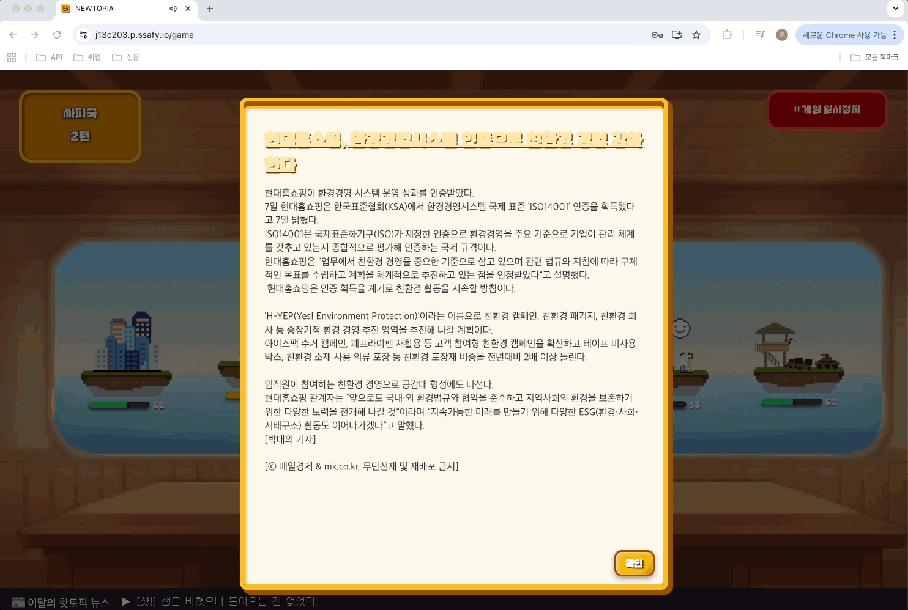
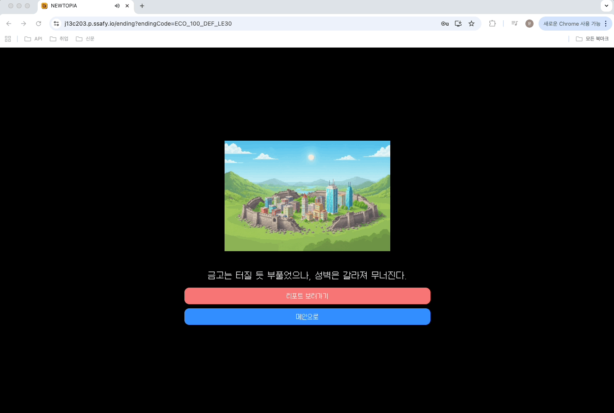
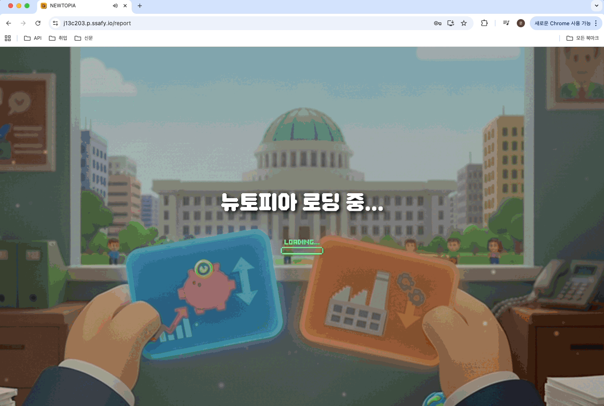

## 프로젝트 소개
### 서비스 한줄 소개
뉴스 데이터 기반 로그라이크 게임 - "NEWTOPIA(뉴토피아)"

### 기획 배경
- 도메인: 빅데이터 분산
- 데이터셋: 800만건의 뉴스 데이터
- 최근 통계에 따르면 뉴스 소비량이 점점 줄어들고 있습니다. 현대 사회에서는 글보다는 영상 콘텐츠, 특히 롱폼보다는 숏폼 미디어가 주로 소비되고 있습니다. 저희 팀은 소비자의 콘텐츠 소비 방식을 이해하고 그에 맞춘 접근이 필요하다고 느꼈습니다.
- 이에 저희 팀은 뉴스를 보면서 현재의 콘텐츠 소비 방식인 도파민을 느낄 수 있는 방법을 고민했고, 그 결과 뉴스를 게임화하여 사용자가 자연스럽게 뉴스를 접하고, 즐기도록 프로젝트를 설계하였습니다.
- 또한 단순한 게임보다는 카드 기반 선택형 게임 ‘레인즈(Reigns)’에서 아이디어를 얻어, ‘뉴스 데이터 기반 로그라이크 게임’을 제작하기로 결정했습니다.

---
## 프로젝트 개요
- NEWTOPIA(뉴토피아)는 NEWS + 유토피아의 합성어로 플레이어는 이세계의 지도자가 되어 실제 뉴스에서 가져온 사건들로 만들어진 시나리오에 대해 두 개의 선택지 중 하나를 선택하고 자신만의 국가를 오래 통치하는 게임입니다.
- 매 턴마다 뉴스 데이터를 기반으로 생성된 시나리오와 선택지가 등장하며, 플레이어는 선택지를 통해 문제를 해결합니다. 플레이어가 오래 통치를 유지하기 위해선 경제, 국방, 민심, 환경 네 가지 지표를 균형있게 유지하여야 합니다.

---
## 주요 타겟
- 게임을 좋아하는 사람들

---
## 프로젝트 진행기간
2025.09.01.~2025.09.29.(약 4주)

---

((## 프로젝트 목표
뉴스 기반 로그라이크 게임 제작, 뉴스 소비와 재미 결합))
((뺄듯합니다))

---
## 프로젝트 특장점
- 뉴스 소비를 게임화하여 자연스럽게 학습 및 재미 제공
- 실제 데이터 기반 시나리오 구성
- 반복 가능성이 높은 로그라이크 장르 활용

---
## 주요 서비스 구성
- Game Server: 게임 로직 처리, 플레이어 선택 반영, 파라미터 계산, 게임 진행 관리 (Spring Boot)
- News Crawler: 뉴스 데이터 수집, 키워드 필터링, 전처리된 데이터 제공 (Spring Boot)
- Frontend: 사용자 인터페이스 제공, 게임 화면 렌더링, 뉴스 및 시나리오 카드 표시 (React + Vite)
- Data Pipeline: 뉴스 데이터 처리, 변환, 분석 모델 연동, Kafka 메시지 송수신 (Kafka Connect, Spark)
- ML Workers: 텍스트 분석 및 감정 분석 수행, 선택지 가중치 산출, 게임 시나리오 반영
- Monitoring: 서비스 상태 모니터링, 메트릭 수집, Grafana 대시보드 제공 (Prometheus, Grafana)

---
## 프로젝트 구조
S13P21C203/
├── data-pipeline/   # Kafka Connect 및 Spark 기반 데이터 처리 관련 코드, 스크립트
├── frontend/        # React + Vite 기반 웹 클라이언트 소스, 컴포넌트, 스타일, 상태관리
├── gameserver/      # Spring Boot 기반 게임 서버 소스, 도메인 로직, API, 서비스 구현
├── kubernetes/      # 배포용 YAML, 설정 파일 등 인프라 관련 구성
├── monitoring/      # Prometheus 설정, Grafana 대시보드 파일, 알람 관련 구성
└── news-crawler/    # Spring Boot 기반 뉴스 수집 서비스 코드, 크롤러, 데이터 전처리

---
## 산출물
### ERD

### 시스템 아키텍처

### 기능 명세서
### 와이어 프레임
### API 명세서

---
## 개발환경
### Game Server & News Crawler
- JDK: Amazon Corretto 17 (Alpine 3.18 기반)
- WAS:
    - Game Server → Spring Boot 3.5.5 + Tomcat
    - News Crawler → Spring Boot 3.4.9 + Netty
- 빌드 도구: Gradle 8.5
- 베이스 OS: Alpine Linux 3.18.4
- Docker Image:
    - amazoncorretto:17-alpine3.18
    - gradle:8.5-jdk17-alpine
    - alpine:3.18.4

### Frontend
- Node.js: 18.19.1 (Alpine 기반)
- 웹 서버: Nginx (Alpine 기반)
- 빌드 도구: Vite 6.3.5
- 프레임워크: React 19.0.0
- Docker Image:
    - node:18.19.1-alpine
    - nginx:alpine

### Database & Middleware
- PostgreSQL: latest
- Redis: 6.2
- Apache Kafka: latest (KRaft 모드)
- MinIO: latest
- Kafka Connect: Confluent 7.5.0

### Monitoring
- Prometheus: latest
- Grafana: latest

---
## 기술 스택
###Backend
- Spring Boot 3.5.5 (Tomcat)
- Spring Boot 3.4.9 (Netty)
- Spring Security
- Spring Data JPA
- Spring Kafka
- Swagger 2.8.5

### Frontend
- React 19.0.0
- React DOM 19.0.0
- TanStack Router 1.130.2
- TanStack Query 5.66.5
- Styled Components 6.1.19
- Zustand 5.0.8
- Tailwind CSS 4.0.6
- TypeScript 5.7.2
- Recharts 3.2.1

### Database
- PostgreSQL latest
- Redis 6.2

### Infra
- Compute: Docker, Kubernetes
- Storage: MinIO (S3 호환 Object Storage)
- Network: Nginx

### Data Pipeline
- Apache Kafka (KRaft 모드)
- Kafka Connect (Confluent 7.5.0)
- Apache Spark

### DevOps
- GitLab Runner (CI/CD)
- Docker Hub (이미지 레지스트리)

### Monitoring
- Prometheus
- Grafana

---
## 기능 소개
### 랜딩

### 로그인 및 회원가입
- 로그인

- 회원가입

### 메인
- 이달의 핫토픽 뉴스

- 공지사항

- 엔딩 도감

- 건의하기

- 랭킹
### 게임 생성
- 새게임 생성하기

- 이전 게임 불러오기

### 게임 진행
- 온보딩

- 초기 게임 시작 화면

- npc&시나리오

- 선택지

- 플레이어의 선택과 선택에 따른 시민 반응

- 연관 뉴스 기사

- 선택에 따른 지표 변동 확인

### 게임 오버 및 엔딩

### 리포트

---
## 고민 및 개선 사항
랭킹 성능 최적화
- 랭킹 조회 속도 향상을 위해 Cache-Aside 패턴 적용: 반복 조회 시 DB 부하 감소
- 랭킹 업데이트 시 Write-Around 전략 적용: 캐시 오염 방지 및 최신 데이터 유지
- 결과적으로 대규모 동시 조회 환경에서도 실시간 랭킹 제공 가능

실시간 이벤트 처리 안정화
- 서버와 클라이언트 간 실시간 데이터 전달을 위해 SSE(Server-Sent Events) 적용
- 연결 안정화 및 이벤트 손실 최소화
- 플레이어 행동 반영과 뉴스/시나리오 카드 동기화 정확도 향상

응답 시간 및 UX 개선
- 시민 반응, 뉴스 댓글, NPC 이벤트를 순차적·점진적으로 출력하여 사용자가 대기 시간 체감 최소화
- 게임 플레이 몰입도 향상, 장기 플레이 시 피로도 감소

데이터 처리 효율화
- sentence-transformers 모델 활용하여 약 800만 건 뉴스 중 게임 시나리오에 적합한 경제/환경/민심/국방 관련 기사 선별
- snunlp/KR-FinBert-SC 모델 기반 긍정·부정 감정 분석을 수행하여 각 선택지의 가중치로 반영
- Kafka JDBC Sink Connector를 활용해 처리된 데이터를 DB로 안정적 적재

빠른 개발-운영 사이클
- 1~3차 MVP 단계별 기능 개선 및 추가
- 사용자 피드백을 적극 반영하여 게임 난이도, UI, 시나리오 흐름 개선
- 반복적 배포와 테스트를 통해 안정적인 서비스 운영

운영 환경 및 모니터링
- 사용자 피드백 수집을 위한 건의사항 게시판 운영
- 구글 애널리틱스 연동으로 사용자 행동 데이터 분석
- Prometheus 및 Grafana 기반 모니터링으로 서버 상태, 게임 지표, 이벤트 처리 상황 실시간 확인

---
## 결과 공유((추가 예정))
### mvp 1차
게임 기능
건의사항
엔딩
리포트
랭킹

### mvp 2차
공지사항 기능 추가
모바일 비율 최적화  
게임 난이도 조정  
이벤트 NPC 추가  
엔딩 도감 시스템  
온보딩(튜토리얼) 추가

### mvp 3차
유저테스트 개선사항 반영

---
## 멤버 소개
